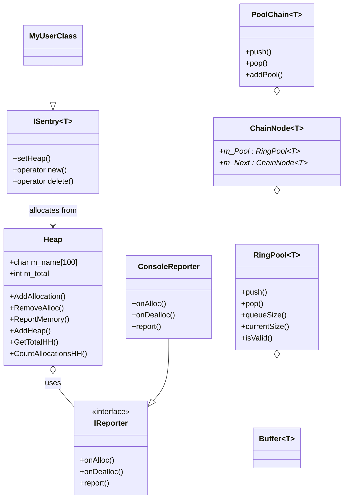

# MemoryManager API Documentation

This document provides an overview of the main API components in the MemoryManager project, including class relationships and usage patterns.

## Table of Contents
- [Heap](Heap.md)
- [Reporter](Reporter.md)
- [ISentry](ISentry.md)
- [Hierarchy](Hierarchy.md)
- [Pools](Pools.md)
- [PoolChain](Pools.md)
- [RingPool](Pools.md)
- [ChainNode](Pools.md)
- [Buffer](Pools.md)

---

## Main Components

### Heap
Manages memory categories, tracks allocations, and supports hierarchical relationships for advanced memory reporting and leak detection.

### Reporter
Abstract interface for memory event logging. Allows plugging in custom reporters (e.g., console, file).

### ISentry
CRTP base class for automatic memory tracking of user-defined types. Ensures all dynamic allocations are tracked by the memory system.

### Hierarchy
Describes the relationships between heaps, supporting hierarchical memory usage queries and graph-based reporting.

### Pools
Lock-free, real-time-safe memory pools for efficient buffer management, including:
- `PoolChain`: Growable chain of pools for scalable allocation.
- `RingPool`: Lock-free, single-producer/single-consumer ring buffer.
- `ChainNode`: Node in the chain, owns a `RingPool`.
- `Buffer`: Storage wrapper for a single object.

---

## Class Diagram

---

For detailed documentation on each component, see the linked markdown files above.
