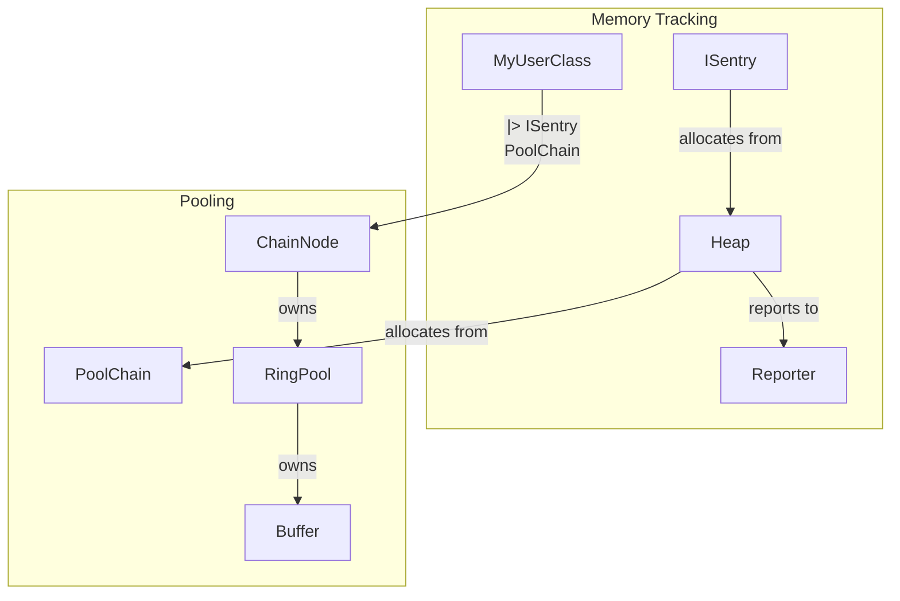

# Architecture

This document describes the overall architecture and main components of the MemoryManager project.

## Overview
MemoryManager is a modular C++ memory tracking and pooling system designed for real-time and high-performance applications. It provides:
- Fine-grained memory tracking by category (Heap)
- Hierarchical heap relationships for aggregate reporting
- Pluggable reporting (Reporter interface)
- Automatic tracking for user types (ISentry)
- Lock-free, real-time-safe memory pools (Pools)

## Architecture Diagram

## Components
- **Heap**: Tracks allocations, supports hierarchy, and integrates with reporters.
- **Reporter**: Interface for logging memory events (console, file, etc).
- **ISentry**: CRTP base for automatic memory tracking of user types.
- **Pools**: Lock-free buffer pools for efficient, real-time memory management.
- **Hierarchy**: Graph-based relationships between heaps for aggregate queries.

## Relationships
- Heaps can be connected to form a hierarchy (graph).
- Each heap can use a reporter for logging.
- ISentry-derived types allocate from their assigned heap.
- Pools provide efficient buffer management for real-time systems.

---

See also: [API.md](API.md)