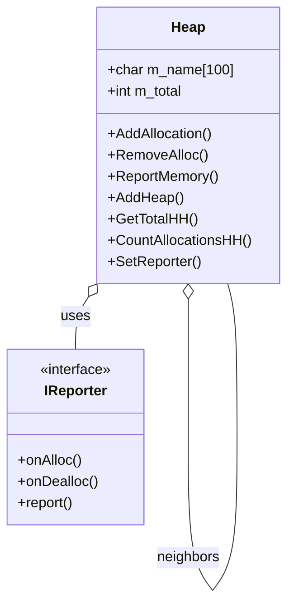

# Heap

The `Heap` class manages a specific memory arena (category), tracking allocations, total bytes, and supporting hierarchical relationships for advanced memory reporting and leak detection.

## Overview
- Tracks all allocations in a doubly-linked list.
- Maintains statistics (total bytes, allocation count).
- Supports hierarchical (graph) relationships with other heaps.
- Integrates with a `Reporter` for logging memory events.

## Key Methods
- `AddAllocation(AllocHeader*)`: Register a new allocation.
- `RemoveAlloc(AllocHeader*)`: Unregister an allocation.
- `ReportMemory(int, int)`: Print all active allocations between two IDs.
- `AddHeap(Heap*)`: Add a neighbor heap (for hierarchy).
- `GetTotalHH()`: Get total memory usage across the heap hierarchy.
- `CountAllocationsHH()`: Count allocations across the heap hierarchy.
- `SetReporter(IReporter*)`: Attach a reporter for event logging.

## Class Diagram


## Example Usage
```cpp
Heap* physicsHeap = new Heap("Physics");
Heap* aiHeap = new Heap("AI");
Heap::HeapFactory::ConnectHeaps(physicsHeap, aiHeap);
physicsHeap->SetReporter(new ConsoleReporter());
```

## Hierarchy
Heaps can be connected to form a graph, allowing aggregate queries (total memory, allocation count) across all connected heaps.

---

See also: [Reporter.md](Reporter.md), [Hierarchy.md](Hierarchy.md)