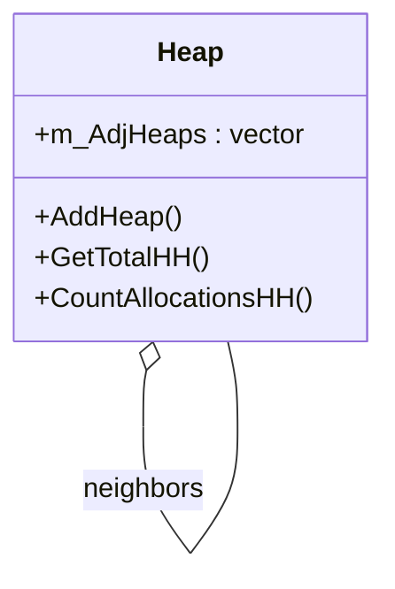

# Hierarchy

The MemoryManager supports hierarchical relationships between heaps, allowing you to group related memory categories and perform aggregate queries across them.

## Features
- Heaps can be connected to form a graph (hierarchy).
- Aggregate memory usage and allocation counts across all connected heaps.
- Thread-safe operations for modifying and querying the heap hierarchy.

## Key Methods
- `AddHeap(Heap*)`: Add a neighbor heap (one-way connection).
- `HeapFactory::ConnectHeaps(Heap*, Heap*)`: Create a bidirectional connection.
- `GetTotalHH()`: Get total memory usage across the hierarchy.
- `CountAllocationsHH()`: Get allocation count across the hierarchy.

## Class Diagram


## Example Usage
```cpp
Heap* graphicsHeap = new Heap("Graphics");
Heap* audioHeap = new Heap("Audio");
Heap::HeapFactory::ConnectHeaps(graphicsHeap, audioHeap);
size_t total = graphicsHeap->GetTotalHH();
```

---

See also: [Heap.md](Heap.md)