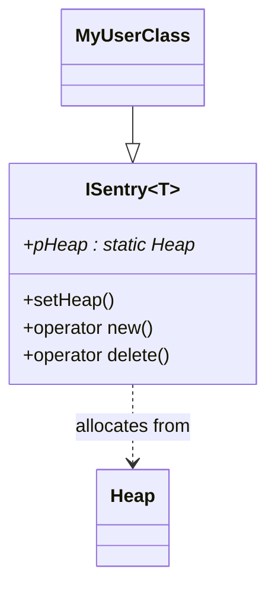

# ISentry


The `ISentry<T>` class is a CRTP (Curiously Recurring Template Pattern) base class that automates memory tracking for derived classes. **User classes should inherit from `ISentry<T>` to ensure all dynamic allocations of your type are tracked by the memory system.**


## Features
- Ensures all `new`/`delete` operations are routed through the memory tracking system.
- Each derived type gets its own static heap pointer.
- Supports custom heap assignment per type.
- Handles standard, aligned, and nothrow allocations.
- **Designed to be inherited by user classes for automatic memory tracking.**

## Key Methods
- `setHeap(Heap*)`: Assign a specific heap for this type.
- Overridden `operator new`/`delete`: Route allocations to the assigned heap.

## Class Diagram


## Example Usage
```cpp
class MyClass : public ISentry<MyClass> {
    // ...
};

MyClass::setHeap(customHeap);
MyClass* obj = new MyClass(); // Allocated from customHeap
```

---

See also: [Heap.md](Heap.md)