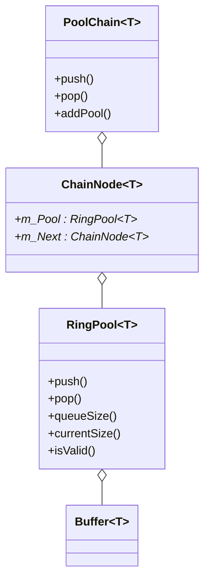

# Pools

The Pools module provides lock-free, real-time-safe memory pools for efficient buffer management. It includes ring buffers and chain-of-pools for scalable, low-latency allocation and deallocation.

## Template Parameters and Restrictions

All pool types use C++ templates for flexibility and type safety:

- `T`: The element type stored in the buffer. **Must NOT be a C-style array** (e.g., `int[]` is forbidden). This is enforced by the `NotRawArray` concept. Use single objects, `std::array`, or user-defined types.
- `alignment` (default: 0): Alignment for the buffer storage. Useful for SIMD or hardware requirements.
- `isDynamic` (default: true): If true, buffers allocate their own storage dynamically; if false, storage is static or externally managed.

**Not allowed:**
- C-style arrays (e.g., `RingPool<int[8]>`) are rejected at compile time.

## Components

## Components
- **RingPool**: Lock-free, single-producer/single-consumer ring buffer of buffer pointers.
- **PoolChain**: Lock-free, growable chain of ring pools (pool-of-pools) for scalable buffer management.
- **ChainNode**: Node in the linked list of pools.


## Features
- Fixed-capacity (RingPool) or growable (PoolChain) buffer pools.
- Single-producer/single-consumer design for real-time safety.
- Atomic operations for thread safety.
- Supports both pool-owned and externally-owned buffers.
- Enforced type safety: no raw C arrays.

## PoolChain Growth and Behavior

`PoolChain` is a lock-free, growable chain of `RingPool` instances (a pool-of-pools). It starts with a single pool. When a `pop()` is requested and all pools are empty, `PoolChain` automatically appends a new `RingPool` to the chain and tries again. This allows the pool to grow on demand, supporting bursty or unpredictable workloads without blocking.

- Each node in the chain (`ChainNode`) owns a `RingPool`.
- Growth is thread-safe for a single producer/consumer.
- The chain is traversed from head to tail for `push()` and `pop()` operations.
- Destruction cleans up all pools and nodes.

**Note:** Cleanup is not thread-safe and should only be called when no other threads are accessing the chain.

## Class Diagram



## Example Usage

```cpp
#include <mem_pools/pool.h>
#include <mem_pools/chain.h>
using namespace MEM_SENTRY::mem_pool;

// Pool owns buffers (full mode)
RingPool<float, 32, true> pool(false, 8, /*Buffer constructor args*/);

// Caller owns buffers (empty mode)
RingPool<MyType> pool2(true, 8);
// ...then push(Buffer<MyType>*) as needed

// Growable pool chain
PoolChain<float, 32, true> chain(8, /*Buffer constructor args*/);
auto* buf = chain.pop(); // If all pools are empty, chain grows automatically
```

---


## What is Not Allowed
- C-style arrays as template arguments (e.g., `RingPool<int[8]>`) are forbidden and will not compile.
- Only single objects, `std::array`, or user-defined types are supported for `T`.

---

See also: [Heap.md](Heap.md)