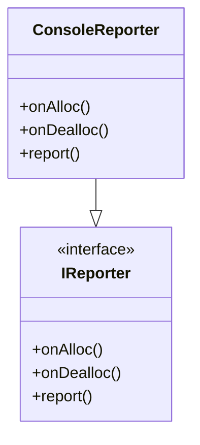

# Reporter

The `Reporter` interface provides hooks for logging memory events (allocation, deallocation, reporting). Custom reporters can be implemented for different logging strategies (console, file, etc).

## Interface
- `onAlloc(AllocHeader*)`: Called on allocation.
- `onDealloc(AllocHeader*)`: Called on deallocation.
- `report(AllocHeader*)`: Called to report allocation details.

## Implementations
- `ConsoleReporter`: Logs memory events to the console.

## Class Diagram


## Example Usage
```cpp
Heap* heap = new Heap("Example");
heap->SetReporter(new ConsoleReporter());
```

---

See also: [Heap.md](Heap.md)